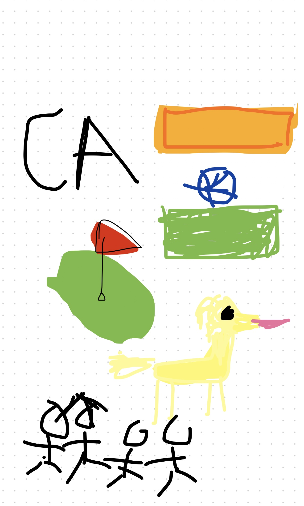

---

layout: default
title: Student Blog
---

## Karam's Blog

## About Me
My name is Karam Kambo and I am on the Del Norte Golf Team. I also like to
do many things like play video games and volunteer at many places like the beach and picking up trash from the beach.
## Issues Encountered
I could not install homebrew because I did not have my computer to the software update of atleast 11.0 for my computer so I had to install many things. After that I could not have th bundle install working because I did not have my zsh installed. I collaborates with the kids in CSA and then they helped me a lot with figuring out the problems and connecting to the local server.

My Freeform:
 

